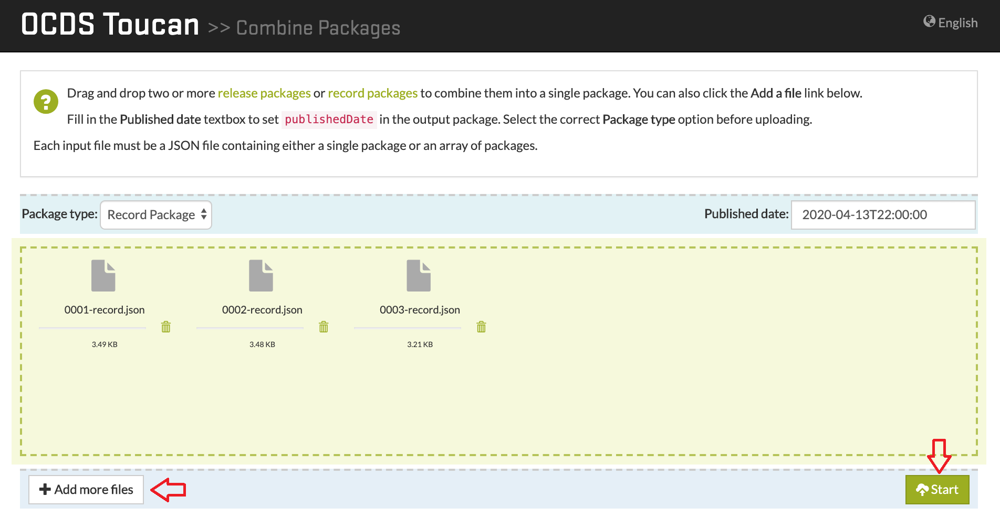
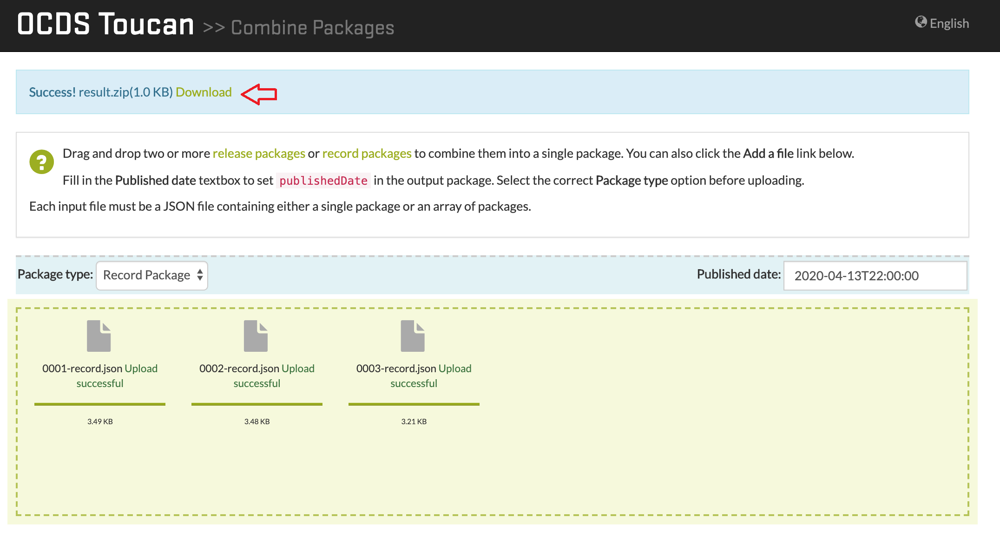
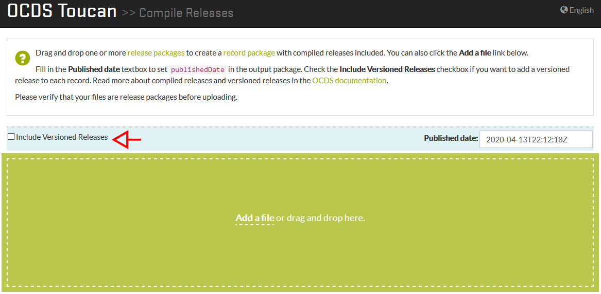

# OCDS Toucan

OCDS Toucan is a web application to transform OCDS files based on [OCDS Kit](https://github.com/open-contracting/ocdskit).
OCDS Toucan provides the same functionalities as OCDS Kit through a intuitive and easy to use web interface.

## Getting Started 
### Requirements
1. Install [Python 3.6+](https://www.python.org/downloads).
2. [Clone](https://help.github.com/en/articles/cloning-a-repository) the Github project.
3. Install [virtualenv](https://docs.python-guide.org/dev/virtualenvs/#lower-level-virtualenv). **Installation is optional, but recommended**. 

### Installation
1. Installing the projects dependencies:
```
pip intall -r requirements.txt
```
2. Set the following environment variables:
* OCDS_TOUCAN_MEDIA_ROOT: path of the directory where the uploaded files will be stored. By default is the `media` folder inside the project's directory.
* OCDS_TOUCAN_LOCALE_PATH: lookup path for .PO files. By default is the `locale` folder inside the project's directory.
* OCDS_TOUCAN_MAXNUMFILES: max number of files to upload per request. Default value is 20.
* OCDS_TOUCAN_MAXFILESIZE: max size of files to upload in bytes. Default value is 10MB.

### Configuration 
The system can be configured by setting the environment variables mentioned above, some of this variables have
default values as shown in the following table

Restriction | Value | Environment Variables
--- | --- | ---
Maximun file size | 10MB | OCDS_TOUCAN_MAXFILESIZE
Maximun quantity of files per request | 20 | OCDS_TOUCAN_MAXNUMFILES

### Project deployment
Running the development server:
```
python manage.py runserver
```

## Functionalities
### Create Release Package
Generates a [Release Package](http://standard.open-contracting.org/latest/en/getting_started/publication_patterns/#packaging-releases-and-records) from one or more [release](http://standard.open-contracting.org/latest/en/getting_started/releases_and_records/#releases) files.
Uses the command `package-releases`. [More Information](https://ocdskit.readthedocs.io/en/latest/cli/ocds.html#package-releases).
>Valid file types: [Release](/tests/fixtures/1.1/releases).

### Combine Packages
Combines release packages or record packages into a single package.		
Uses the `combine-record-packages` command for record packages
and the `combine-release-packages` command for release packages. More information: [`combine-record-packages`](https://ocdskit.readthedocs.io/en/latest/cli/ocds.html#combine-record-packages) and [`combine-release-packages`](https://ocdskit.readthedocs.io/en/latest/cli/ocds.html#combine-release-packages).
>Valid file types: [Release Packages](/tests/fixtures/1.1/release-packages), [Record Packages](/tests/fixtures/1.1/record-packages).

### Compile Releases
Generates a [Record Package](http://standard.open-contracting.org/latest/en/getting_started/publication_patterns/#packaging-releases-and-records) from Release Package files.
Uses the `compile` command. **Attention**: the `--package` flag is used by default, visit the [documentation](https://ocdskit.readthedocs.io/en/latest/cli/ocds.html#compile) for more information. 
>Valid file types: [Release Packages](/tests/fixtures/1.1/release-packages).

### Upgrade from 1.0 to 1.1
Updates packages and releases from OCDS version 1.0 to 1.1.
Uses the `upgrade` command. [More information](https://ocdskit.readthedocs.io/en/latest/cli/ocds.html#upgrade).
>Valid file types: Any OCDS file.

### Generate a spreadsheet version of schema
Generates a spreadsheet of any OCDS schema version.
Uses the `mapping-sheet` command. [More Information](https://ocdskit.readthedocs.io/en/latest/cli/schema.html#mapping-sheet).
>Valid file types: [Release](/tests/fixtures/1.1/releases), [Release Packages](/tests/fixtures/1.1/release-packages) o [Record Packages](/tests/fixtures/1.1/record-packages).

### Convert to CSV/Excel
Converts a Release Package file to a CSV/Excel version.
Uses [flatten-tool](https://github.com/OpenDataServices/flatten-tool).
>Valid file types: [Release Packages](/tests/fixtures/1.1/release-packages).

### Convert to JSON
Converts a CSV or Excel file extension into a release package.	
Uses [flatten-tool](https://github.com/OpenDataServices/flatten-tool).
>Valid file types: [Release Packages](/tests/fixtures/1.1/release-packages).

## Architecture
### Architectures Description
This web application use Django Framework.
The OCDS Kit and the flatten-tool are used as support libraries.


### Design
Applications home page:


### Restrictions
The systems rectrictions are as follows:

Restriction|Value
--- | ---
Maximun file size | 10MB
Maximun quantity of files per request | 20
Session timeout | 24 hours

## Use examples

The screenshots that follow were taken in April 2020. Each section provides sample files that can be used to test the feature.

### 1. Create a Release Package
[Sample files](/tests/fixtures/1.1/releases)
1. Select a file clicking the "Add a file" link or by dragging a file to the page. 

2. Add more files with the "Add more files"(2.1) button. When you're ready, click "Start" (2.2). 

3. Wait for the processing to finish. A link will appear in the top of the page to download the release package.


### 2. Combine Packages

#### 2.1 Release Package
[Example files](/tests/fixtures/1.1/release-packages)
1. Select one or more Release Package files using the "Add a file" link  or by dragging files to the page. In this example we use the [Release Packages 1.1](/tests/fixtures/1.1/release-packages) files. 

2. Add more files by using the "Add more files" button or by dragging and dropping files in the page. When you're ready, click "Start".

3. Once the transformation process is finished, a download link will appear at the top of the page.


### 2.2 Record Package
[Sample files](/tests/fixtures/1.1/record-packages)
1. Select one or more release package files with the "Add a file" link or by dragging and dropping files in the page.

2. Add more files with the "Add more files" button or by dragging and dropping files in the page. When you're ready, click the "Start" button.

3. Once the processing ends, a download link will appear at the top of the page.


### 3. Compile Release Packages
[Sample files](/tests/fixtures/1.1/release-packages)
1. Select one or more files with the "Add a file" link or by dragging and dropping files in the page.
2. By default, versioned releases are included in the records. If you don't need this, find the "Include versioned releases" checkbox and remove the check mark with a click.

3. Click the "Start" button, and wait for the processing to end. A download link will appear at the top of the page.


### 4. Update a 1.0 OCDS file to 1.1
1. Select one or more Release/Record Package version 1.0 files. For this example we will be using [this](/tests/fixtures/1.0/release-packages/0001-tender.json) test file.
2. We can add more 1.0 files or start the conversion.
3. Once finished, a message will appear to download the updated files.

### 5. Generate a spreadsheed version of a OCDS schema
1. Select the schema type and the version to generate. In this example we will be using a Release Package Schema 1.1.

2. A file with .csv extention will be generated, and automatically dowloaded

### 6. Convert a Release Package to .csv
1. Select the Release Package to convert. Only one can be uploaded. We will be using [this](/tests/fixtures/1.1/release-packages/0002-tender.json) test file.
2. Two files will be generated, a .xlsx file and a compressed file with .csv files, that contain data from the Release Package.


### 7. Convert to JSON
1. Select the file with .csv or .xlsx extention to convert. For multiple .csv files, compress them in .zip format. For this example we use [this](/tests/fixtures/1.1/spreadsheets/flattened.csv) file. 

2. After selecting the file, click the "Start" button to start the operation.

3. Once finished, a message to download the generated file will appear.


## Used Tools
* [Python 3.6+](https://www.python.org/) - Interpreted programming language
* [Django 2.2](https://www.djangoproject.com/) - Python Web Framework
* [JQuery 3.3](https://jquery.com/) - JavaScript library.
* [Bootstrap 3+](https://getbootstrap.com/) - Multiplatform library.

