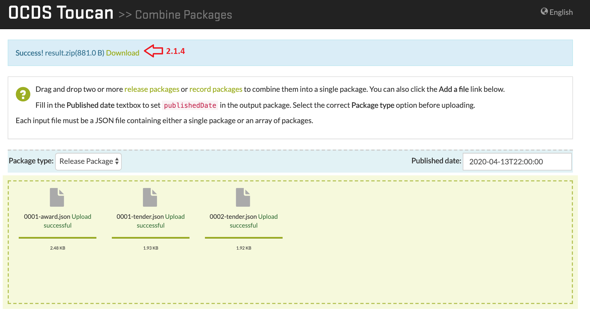
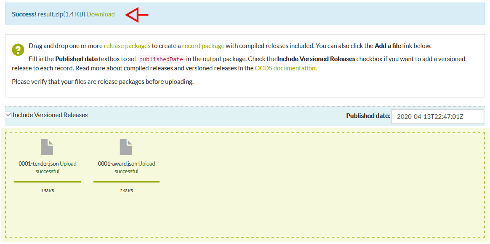
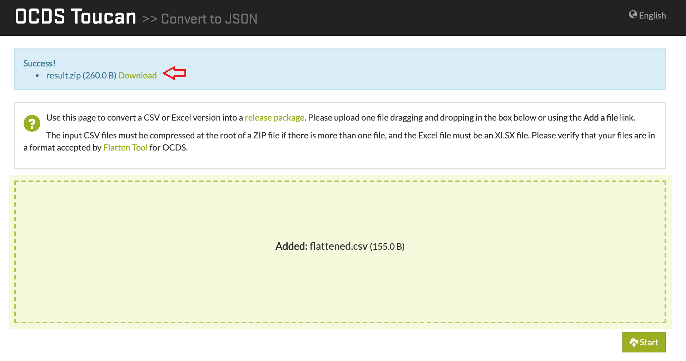

# OCDS Toucan

OCDS Toucan is a web application for handling OCDS files based on [OCDS Kit](https://github.com/open-contracting/ocdskit).
OCDS Toucan provides the same functionalities as OCDS Kit through a intuitive and easy to use web interface.

## Starting up
### Requirements
1. Install [Python 3.6+](https://www.python.org/downloads).
2. [Clone](https://help.github.com/en/articles/cloning-a-repository) the Github project.
3. Install [virtualenv](https://docs.python-guide.org/dev/virtualenvs/#lower-level-virtualenv). **Installation is optional, but recommended**. 

### Installation
1. Installing the projects dependencies:
```
pip intall -r requirements.txt
```
2. Set the following environment variables:
* OCDS_TOUCAN_MEDIA_ROOT: path of the directory where the uploaded files will be stored. Any directory of your choice
* OCDS_TOUCAN_LOCALE_PATH: path to the "locale" directory inside the project.
* OCDS_TOUCAN_MAXNUMFILES: max number of files to upload per request.
* OCDS_TOUCAN_MAXFILESIZE: max size of files to upload in bytes.

### Restrictions
The systems rectrictions are as follows:

Restriction|Value
--- | ---
Maximun file size | 10MB
Maximun quantity of files per request | 20
Session timeout | 24 hours

### Project deployment
Running the development server:
```
python manage.py runserver
```

## Functionalities
### Create Release Package
Generates a [Release Package](http://standard.open-contracting.org/latest/en/getting_started/publication_patterns/#packaging-releases-and-records) from many [Release](http://standard.open-contracting.org/latest/en/getting_started/releases_and_records/#releases) files.
Uses the command `package-releases`. [More Information](https://ocdskit.readthedocs.io/en/latest/cli/ocds.html#package-releases).
>Valid file types: Release.

### Compile Releases
Generates a [Record Package](http://standard.open-contracting.org/latest/en/getting_started/publication_patterns/#packaging-releases-and-records) from Release Package files.
Uses the command `compile`. **Attention**: this command uses `--package` and `--versioned` as parameters, visit the [documentation](https://ocdskit.readthedocs.io/en/latest/cli/ocds.html#compile) for more information. 
>Valid file types: Release Package.

### Upgrade from 1.0 to 1.1
Updates packages and releases from OCDS version 1.0 to 1.1.
Uses the command `upgrade`. [More information](https://ocdskit.readthedocs.io/en/latest/cli/ocds.html#upgrade).
>Valid file types: Any OCDS file.

### Generate a spreadsheet version of schema
Generates a spreadsheet of any OCDS schema version.
Uses the command `mapping-sheet`. [More Information](https://ocdskit.readthedocs.io/en/latest/cli/schema.html#mapping-sheet).
>Valid file types: Release, Release Package, Record Package.

### Convert to CSV/Excell
Converts a Release Package file to a CSV/Excel version.
Uses [flatten-tool](https://github.com/OpenDataServices/flatten-tool).
>Valid file types: Release Package.

## Architecture
### Architectures Description
Django Framework is to build the Front-end and backend modules of the application.
The Front-end module contains the user-interaction elements.
In the Back-end module, the OCDS Kit and flatten-tool are implemented as libraries that implement the functionalities.


### Design
Applications home page:


## Use examples
### 1. Create a Release Package
1. Select a file with "Add a file" or by dragging it to the rectangle. We will be using [Release 1.1](/tests/fixtures/1.1/releases) files.

2. Add more files with the "Add more files" button or create a Release Package with "Start" (2.2). 

3. When finished, a message will appear to download the generated Release Packaged.


### 2. Combine Packages
#### 2.1 Release Package
1. For this example we selected the Release Package option in the Package type dropdown list.
2. Select one or more Release Package files with "Add a file" or by dragging to the rectangle. In this example we use the [Release Packages 1.1](/tests/fixtures/1.1/release-packages).
 files.
3. We can add more files with the "Add more files" button or by dragging to the rectangle, or we can start the operation with "Start".

4. Once finished, a message will appear to download the generated file.


### 2.2 Record Package
1. For this example we selected the Record Package option in the Package type dropdown list.
2. Select one or more Release Package files with "Add a file" or by dragging to the rectangle. In this example we use the [Record Packages 1.1](/tests/fixtures/1.1/record-packages).

3. We can add more files with the "Add more files" button or by dragging to the rectangle, or we can start the operation with "Start".

4. Once finished, a message will appear to download the generated file.


### 3. Compile Release Packages
1. Select a file with "Add a file" or by dragging to the rectangle, just as the first example. We will use the [Release Packages 1.1](/tests/fixtures/1.1/release-packages) examples.
2. Just as the example before, we can add more files or start  the operation. We also have the option to include Release versioning on our Record Package that will be generated.

3. Just as the example before, a message to download the generated Record Package appears.


### 4. Update a 1.0 OCDS file to 1.1
1. Select one or more Release/Record Package version 1.0 files. For this example we will be using [this](/tests/fixtures/1.0/release-packages/0001-tender.json) test file.
2. We can add more 1.0 files or start the conversion.
3. Once finished, a message will appear to download the updated files.

### 5. Generate a spreadsheed version of a OCDS schema
1. Select the schema type and the version to generate. In this example we will be using a Release Package Schema 1.1.

2. A file with .csv extention will be generated, and automatically dowloaded

### 6. Convert a Release Package to .csv
1. Select the Release Package to convert. Only one can be uploaded. We will be using [this](/tests/fixtures/1.1/release-packages/0002-tender.json) test file.
2. Two files will be generated, a .xlsx file and a compressed file with .csv files, that contain data from the Release Package.


### 7. Convert to JSON
1. Select the file with .csv or .xlsx extention to convert. For multiple .csv files, compress them in .zip forma. For this example we use [this](/tests/fixtures/1.1/spreadsheets/flattened.csv) file. 

2. Ater selecting the file, click the "Start" button to start the operation.

3. Once finished, a message to download the generated file will appear.


## Used Tools
* [Python 3.6+](https://www.python.org/) - Interpreted programming language
* [Django 2.3](https://www.djangoproject.com/) - Python Web Framework
* [JQuery 3.3](https://jquery.com/) - JavaScript library.
* [Bootstrap 3+](https://getbootstrap.com/) - Multiplatform library.

## Versioning
Git is used for version control.

## Licensing
Copyright (c) Open Contrantig Partnership
